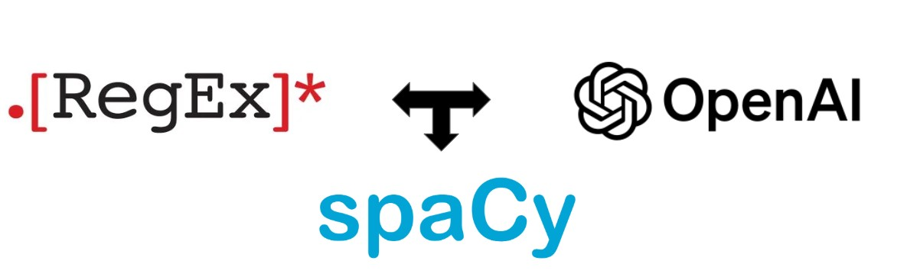

# Text Normalization System 

This project focuses on text normalization of a dataset by utilizing rule based techniques(e.g. regex patterns)
as well as named entity recognition using a spacy model. 
At the end of the pipeline there is an extra filtering layer, utilizing the power of an OpenAI LLM model. 




1. **Create a virtual environment**  
   ```bash
   python -m install virtualenv venv
   ```
   - Make sure it is integrated as your interpreter (e.g. in PyCharm).
2. **Activate the virtual environment**  
   - **Windows**: `.\venv\Scripts\activate`  
   - **Unix**: `./venv/bin/activate`
3. **Install dependencies**  
   ```bash
   pip install -r requirements.txt
   ```
4. Create a .env file and paste environment variable for OPEN_AI_API_KEY:
    ```
    echo "OPENAI_API_KEY=<your-key>" >> .env
    ```
5. Add a dataset named ***raw_data.csv*** in the dataset directory
6. **Run the clean data script**
    ```bash
    python ./scripts/clean_data.py
    ```
   - This will generate a cleaned_data.csv in dataset directory.
7. **Run the OpenAI clean data script**
    ```bash
    python ./scripts/openai_clean_data.py
    ```
   - ***This will require an OPENAI_API_KEY***