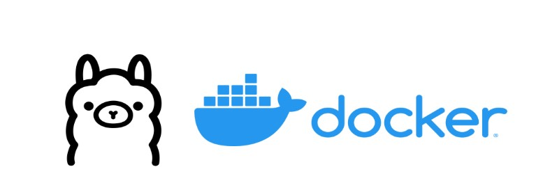

# Text Normalization System Using Ollama

This is a system running with **llama3**, enabling text normalization on a dataset of your choice.  
Docker is used to spin up a MongoDB instance for this project.



1. **Download [Ollama](https://ollama.com/)**  
2. **Run Ollama**  
   ```bash
   ollama run llama3.1:8b-instruct-q4_0
   ```
3. **Create a virtual environment**  
   ```bash
   python -m install virtualenv venv
   ```
   - Make sure it is integrated as your interpreter (e.g. in PyCharm).
4. **Activate the virtual environment**  
   - **Windows**: `.\venv\Scripts\activate`  
   - **Unix**: `./venv/bin/activate`
5. **Install dependencies**  
   ```bash
   pip install -r requirements.txt
   ```
6. Create a .env file and paste environment variable for OPEN_AI_API_KEY:
    ```
    echo "OPENAI_API_KEY=<your-key>" >> .env
    ```
7. Add a dataset named ***raw_data.csv*** in the dataset directory
6. **Run the clean data script**
    ```bash
    python ./scripts/clean_data.py
    ```
   - This will generate a cleaned_data.csv in dataset directory
7. **Run any of the LLM clean script**  
    ```bash
    python ./scripts/ollama_clean_data.py
    ```
   or
    ```bash
    python ./scripts/openai_clean_data.py
    ```
   - ***This will require an OPENAI_API_KEY***